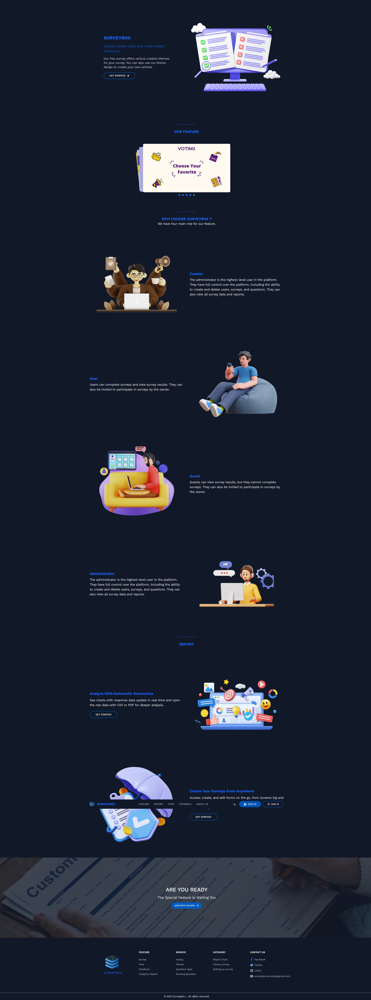
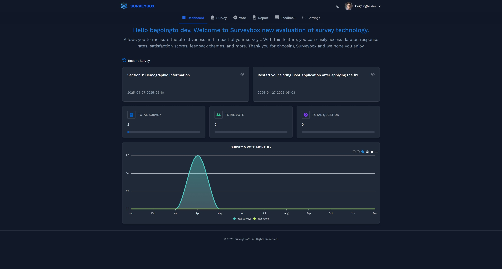
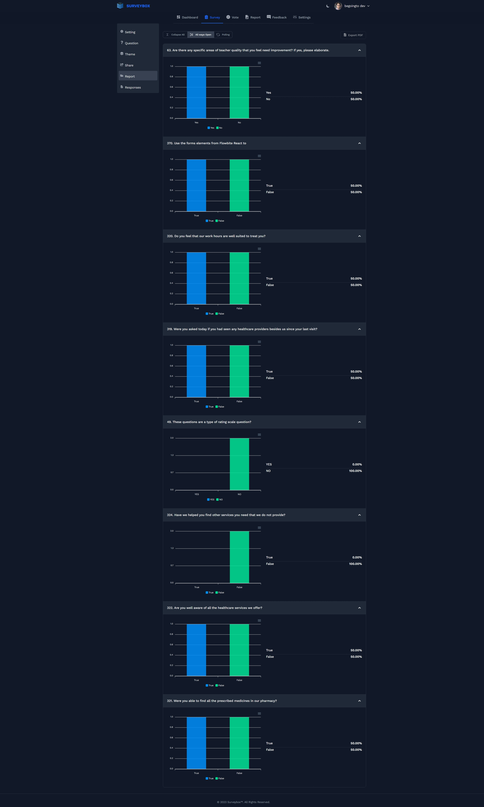
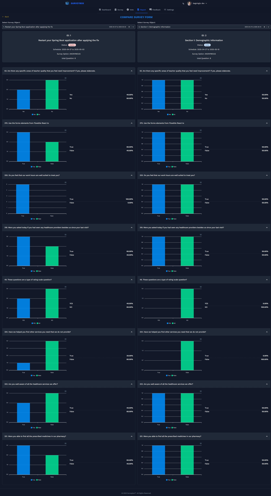

# SurveyBox

Our survey platform is a powerful tool that can help you collect data from your target audience. With our platform, you can create surveys in minutes, distribute them to your audience, and collect data in real time.


# Get Start Development

Make sure you are installed docker. so you can 

**Noted**: I would like recommend you should be URL configure set your laptop IP address example: 
- ```http://localhost:3000``` to ```http://192.168.0.44:3000```
- ```http://localhost:8081``` to ```http://192.168.0.44:8081```

***
# Copy `.env.example`

```shell
cp .env.example .env
```
Add some value to variables **follow**
## ``NEXTAUTH_SECRET`` using `openssl rand -base64 32`
## ``NEXT_PUBLIC_GOOGLE_CLIENT_ID`` to get https://console.cloud.google.com/apis/credentials 
## ``NEXT_PUBLIC_SECRET_KEY`` and ``NEXT_PUBLIC_SECURE_LOCAL_STORAGE_PREFIX`` using ```head -c64 /dev/urandom | tr -dc 'A-Za-z0-9~!@`%$^&*='```
## Mail Configuration you can get from https://mailtrap.io testing

## Docker compose run development
```shell
docker compose -f docker-compose.yml up -d
```

## Website Url
- Base URL: http://localhost:3000/
- API URL: http://localhost:8081/api/v1 
- Users:
  - ```admin@surveybox.com``` password: ```Admin@12345```
  - ```creator@surveybox.com``` password: ```Admin@12345```
- Deployment: https://surveybox.com
- Page URL:
    1. Public Page:
    - Home : /
    - Feature : /feature
    - Report : /report
    - Vote : /votes
    - Feedback : /feedback
    - About Us : /about-us
    - Login : /sign-in
    - Register : /sign-up

  ## U need to sign up with google after that u will see the    dashboard
  -Click the dashboard button and u will see the surveycreator Page

  ### 2 . SurveyCreator Page :
    - Dashboard : /surveycreator/dashboard
    - Survey : /surveycreator/survey
    - Vote :/surveycreator/vote
    - Report : /surveycreator/report
    - Feedback : /surveycreator/feedback
    - Setting : /surveycreator/settings/user
    - Share :  /surveycreator/survey/share/[[..id]]
    - Responses :  /surveycreator/survey/responses/[id]
    - Compare survey: /surveycreator/report/compares
  
  Noted:On the card survey, there are icons for sitting, question, share, report, and duplicate,so you can click this icon. It will go to each section.


    ### 3 . Admin Dashboard Page :
    - Dashboard : /admin/dashboard
    - Question : /admin/question
    - Category  : /admin/category

    $note :The admin side only works with questions, dashboards, and categories; the others haven't been done yet.


## How to get our project
- Git url: https://github.com/begoingto/surveybox-app.git
- Clone the project (requirement node version 16 up)
- Type command: npm install
- Run project: npm run dev
### Configuration environment variable
- Copy file .env.example to .env and fill the environment variable

  NEXTAUTH_SECRET=

  NEXTAUTH_URL=

  GOOGLE_CLIENT_ID=

  GOOGLE_CLIENT_SECRET=
  .
  .
  .
  ...
- Open http://localhost:3000 with your browser to see the result.



